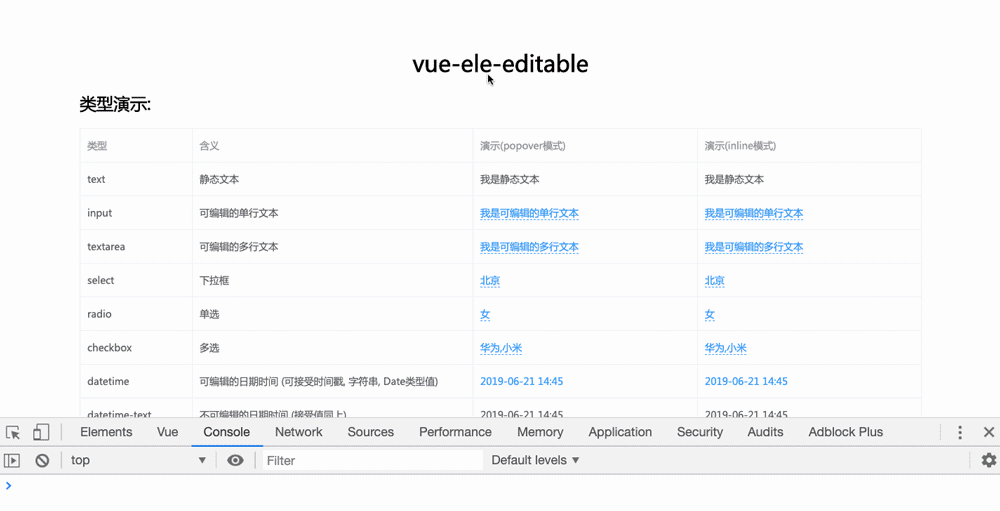

# vue-ele-editable | 高效、简单、强大的 element-ui 行内编辑组件

[](https://opensource.org/licenses/mit-license.php)
[](https://www.npmjs.com/package/vue-ele-editable)
[](https://npmcharts.com/compare/vue-ele-editable?minimal=true)

## 介绍

vue-ele-editable 是一个高效、简单、强大的 element-ui 行内编辑组件, 引用组件后, 仅通过数据就可以完成行内编辑功能, 具体特点如下:

- 支持多种内置组件: input、select、radio、checkbox、textarea、date、time、datetime、text、url、status、switch、image、upload-image、time-text、date-text、datetime-text、color、number
- 支持 Popover 和 Inline 两种模式
- 支持数据校检、自定义属性、自定义显示数据、自定义发送数据
- 足够简单, 仅需要 1 行 html 代码和数据即可

> 为了帮助您更好的了解和使用, star 数超过 100 的话, 有视频源码讲解, 希望能给个 star😘😘😘

## 效果图

[](https://codepen.io/dream2023/pen/dBNNbP)

## 在线示例

[https://codepen.io/dream2023/pen/dBNNbP](https://codepen.io/dream2023/pen/dBNNbP)

## 安装

```bash
npm install vue-ele-editable --save
```

## 使用

```js
import EleEditable from 'vue-ele-editable'
Vue.use(EleEditable)

// 在引入 EleEditable 时，可以传入一个全局配置对象
// key 是组件名, value 是组件的属性, 例如:
Vue.use(EleEditable, {
  // 所有 image 类型的组件都会有 lazy: true 的属性
  image: {
    lazy: true
  },
  // 所有的 number 类型的组件都会有 step: 10 的属性
  number: {
    step: 10
  },
  ...
})
```

## Props

### 参数总览

```js
props: {
  // 类型
  type: {
    type: String,
    default: 'text'
  },
  // 字段
  field: {
    type: String,
    required: true
  },
  // 是否为行内
  inline: {
    type: Boolean,
    default: false
  },
  // 标题
  title: String,
  // 字段值
  value: [String, Number, Boolean, Array, Date],
  // 默认值
  defaultValue: {
    type: [String, Number, Boolean, Array, Date],
    default: null
  },
  // 自定义组件是否需要包裹
  isNoWrapper: {
    type: Boolean,
    default: false
  },
  // 选项
  options: {
    type: Array,
    default () {
      return []
    }
  },
  // 请求地址
  requestFn: Function,
  // 校检规则
  rules: [Array, Object],
  // 其他附带数据
  customData: Object,
  // 自定义属性
  customAttrs: Object,
  // 格式化显示数据
  displayFormatter: Function,
  // 对请求数据格式化
  valueFormatter: Function,
  // 值空时显示的文本
  emptyText: {
    type: String,
    default: '空'
  }
}
```

### 参数讲解

#### type:

`type` 用于指定渲染组件, 目前支持的内置组件有:

| 类型          | 含义                                                 | 属性参考                                                                                 |
| ------------- | ---------------------------------------------------- | ---------------------------------------------------------------------------------------- |
| text          | 静态文本                                             |                                                                                          |
| image         | 单个图片/多张图片                                    | [vue-ele-gallery](https://github.com/dream2023/vue-ele-gallery)                          |
| upload-image  | 上传图片                                             | [vue-ele-upload-image](https://github.com/dream2023/vue-ele-upload-image)                |
| input         | 可编辑的单行文本                                     | [element-ui input](https://element.eleme.cn/#/zh-CN/component/input)                     |
| textarea      | 可编辑的多行文本                                     | [element-ui input](https://element.eleme.cn/#/zh-CN/component/input)                     |
| select        | 下拉框                                               | [element-ui select](https://element.eleme.cn/#/zh-CN/component/select)                   |
| number        | 可编辑数字                                           | [element-ui input-number](https://element.eleme.cn/#/zh-CN/component/input-number)       |
| radio         | 单选                                                 | [element-ui radio](https://element.eleme.cn/#/zh-CN/component/radio)                     |
| checkbox      | 多选                                                 | [element-ui checkbox](https://element.eleme.cn/#/zh-CN/component/checkbox)               |
| datetime      | 可编辑的日期时间 (可接受时间戳, 字符串, Date 类型值) | [element-ui datetime-picker](https://element.eleme.cn/#/zh-CN/component/datetime-picker) |
| datetime-text | 不可编辑的日期时间 (接受值同上)                      |                                                                                          |
| date          | 可编辑的日期 (接受值同上)                            | [element-ui date-picker](https://element.eleme.cn/#/zh-CN/component/date-picker)         |
| date-text     | 不可编辑的日期 (接受值同上)                          |                                                                                          |
| time          | 可编辑的时间 (接受值同上)                            | [element-ui time-picker](https://element.eleme.cn/#/zh-CN/component/time-picker)         |
| time-text     | 不可编辑的时间 (接受值同上)                          |                                                                                          |
| status        | 状态                                                 | [element-ui tag](https://element.eleme.cn/#/zh-CN/component/tag)                         |
| switch        | 开关                                                 | [element-ui switch](https://element.eleme.cn/#/zh-CN/component/switch)                   |
| url           | 链接                                                 |                                                                                          |
| color         | 颜色                                                 | [element-ui color-picker](https://element.eleme.cn/#/zh-CN/component/color-picker)       |

当`type`不是以上任何一个类型时, 就会按照传递的名字渲染, 可以进行自定义扩展组件, 具体参考 [自定义扩展示例 rate](./example/CustomRate.vue), [自定义扩展示例 slider](./example/CustomSlider.vue), 具体表现形式, 请看[在线示例](https://codepen.io/dream2023/pen/dBNNbP)

### isNoWrapper:

`isNoWrapper`用于自定义组件是否需要包裹, 举例, input 是包裹组件, switch 就是不包裹组件, 内置组件的包裹与否无法改变, 只能改变自定义组件, 例如上面的 `rate` 组件就是不包裹, `slider`组件就是包裹组件

### customAttrs:

`customAttrs` 自定义组件属性, 例如将 input 变为密码框:

```js
{
  type: 'input',
  // 属性参考 element-ui input组件
  customAttrs: {
    'show-password': true
  }
}
```

### field:

`field` 用于发送请求, 作为数据的 `key`, 例如:

```js
{
  value: 'zhang'
  field: 'name'
}

// 最终发送的数据为:
{
  name: 'zhang'
}
```

### inline:

`inline` 用于指定是采用 `popover` 还是 `inline` 的模式, 默认为 `popover`

### title:

`title` 用于弹窗的标题

### value:

`value` 值, 可用 `v-model` 绑定

### defaultValue:

`defaultValue` 当 `value` 不存在时, 代替 `value`, 例如:

```js
{
  value: '',
  field: 'name',
  defaultValue: '匿名'
}

// 最终显示到屏幕上为: 匿名
```

### displayFormatter:

`displayFormatter` 用于对值显示的进一步处理, 例如:

```js
// 伪代码
{
  value: 10,
  displayFormatter: function (value) {
    return `${value} 岁`
  }
}

// 最终显示到屏幕上为: 10 岁
```

### emptyText:

`emptyText` 用于当无数据时, 显示的字符串, 例如:

```js
{
  field: 'mobile',
  // 当 value, defaultValue 和 displayFormatter都返回空时, 才起作用
  value: '',
  defaultValue: '',
  displayFormatter: null,
  emptyText: '无手机可用'
}

// 最终显示到屏幕上为: 无手机可用
```

### options:

`options` 用于 checkbox、radio、select、status 组件的选项, 支持对象数组和字符串数组:

```js
// 对象数组形式 (text 用于展示, 实际值是 value)
options: [{ text: '男', value: 'male' }, { text: '女', value: 'female' }]

// 字符串数组 (相当于 [{ text: '男', value: '男' }, { text: '女', value: '女' }])
options: ['男', '女']
```

### requestFn:

`requestFn` 请求函数, 此函数无论如何最终要返回一个 `Promise` 示例, 用于判断请求的状态和结果

有两种情况, 一种是你需要对原请求的响应结果进行处理, 可以套一层 Promise:

```js
// 伪代码
async function requestFn(data) {
  return new Promise((resolve, reject) => {
    try {
      const res = await axios.post('/post', data)
      // 对res做各种处理
      ...
      resolve()
    } catch(e) {
      reject(e)
    }
  })
}
```

另一个种是不需要处理, 可以直接返回一个`Promise`对象

```js
async function requestFn(data) {
  return axios.post('/post', data)
}
```

### rules:

`rules` 用于校检, 校检规则同 element-ui 的 form 一样, 都是使用的 [async-validator](https://github.com/yiminghe/async-validator), 支持数组和对象两种形式, 例如:

```js
// 对象
rules: {
  required: true,
  message: '名称不能为空'
}

// 数组
rules: [
  { type: 'number', message: '年龄必须填写数字' },
  { required: true, message: '年龄必填填写' }
]
```

### customData:

`customData` 用于携带额外数据, 例如:

```js
// 伪代码

// props的值
{
  field: 'name',
  value: 'zhangchaojie',
  customData: {
    id: 10,
    status: 1
  }
}

// 最终发送的数据为:
{
  name: 'zhangchaojie',
  id: 10,
  status: 1
}
```

### valueFormatter:

`valueFormatter` 用于对请求数据的进一步处理, 例如:

```js
// 伪代码

// props 值
field: 'age',
value: 10,
customData: { id: 1 },
valueFormatter: function (value) {
  return value + 1
}

// 最终发送的值为:
{
  age: 11,
  id: 1
}
```

## 参考链接

- [x-editable](http://vitalets.github.io/x-editable)
- [element-ui](http://element-cn.eleme.io)
- [dolphinphp](https://www.kancloud.cn/ming5112/dolphinphp/256299)
